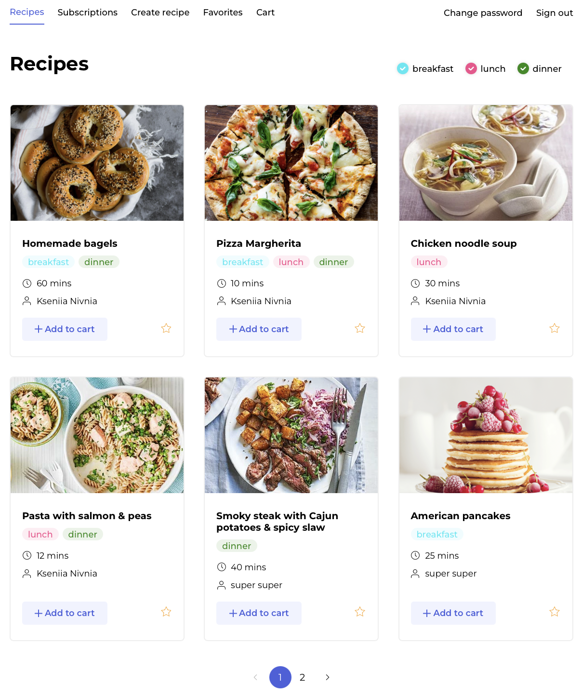
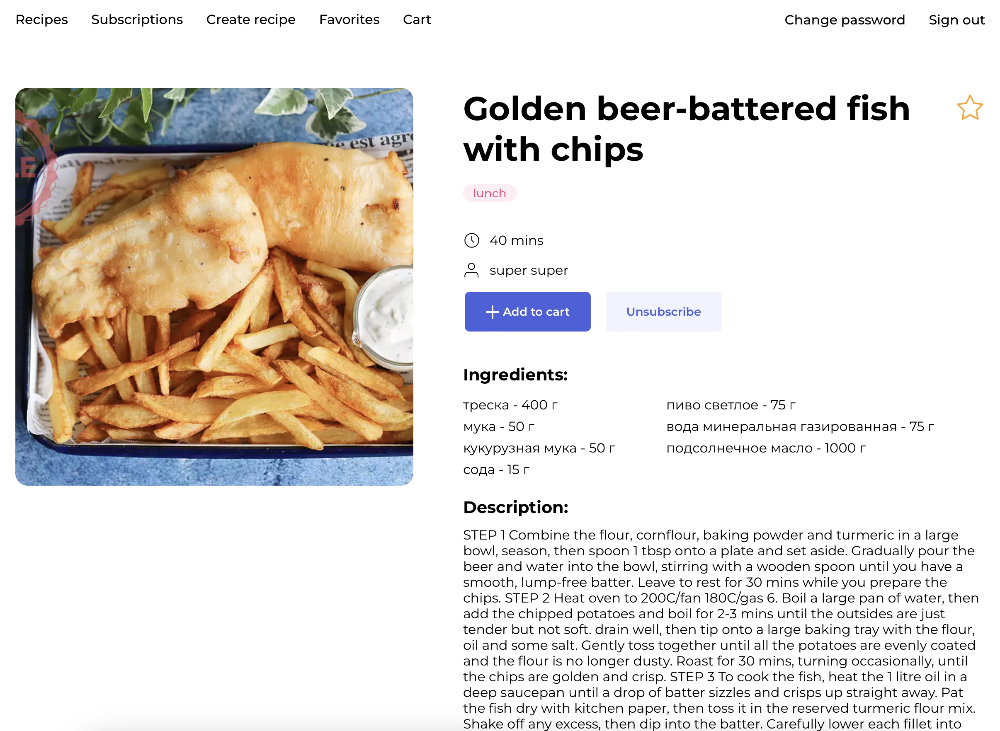
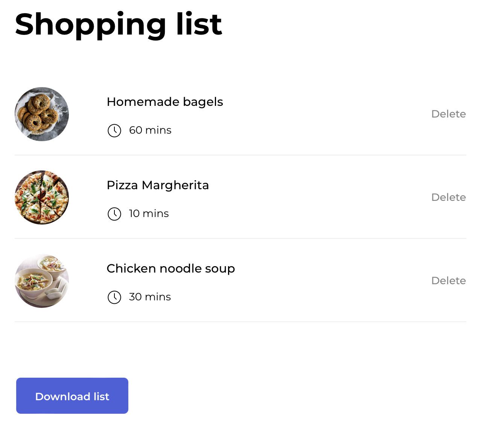
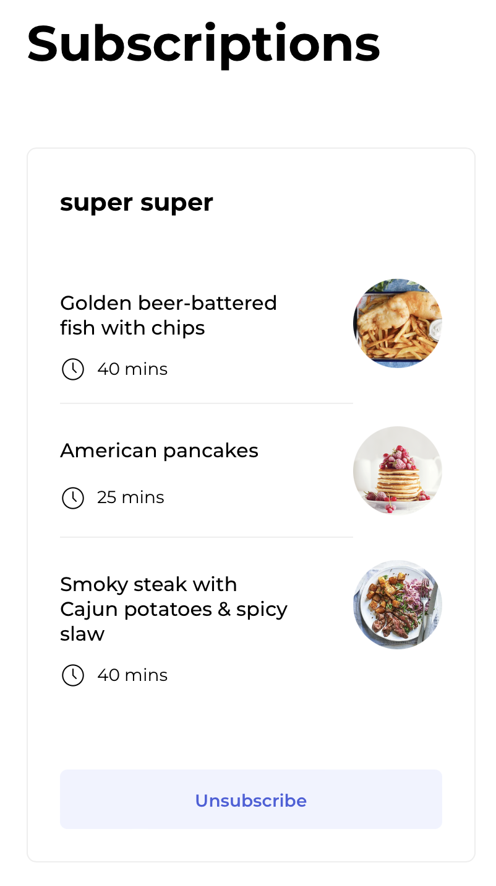

# Foodgram project

### Foodgram - recipe sharing website

##### Description

Service for sharing your favorite recipes, subscribe on other users, add recipes to the favorites and add items to a downloadable shopping list

##### Technologies

- Python 3.9
- Django 4.1.2
- Django REST framework
- Docker
- Docker Hub
- GitHub Actions

##### .env file template

```
# in project_directory/project_name/project_name/.env
# specify the database - postgresql
DB_ENGINE=django.db.backends.postgresql
# specify database name
DB_NAME=foodgram
# specify username
POSTGRES_USER=foodgram_user
# specify password
POSTGRES_PASSWORD=xxxyyyzzz
# specify localhost
DB_HOST=127.0.0.1
# specify post for connection to database
DB_PORT=5432
```


##### Up the container

```
docker-compose up -d --build 
docker-compose exec <container ID> python manage.py migrate
docker-compose exec <container ID> python manage.py loaddata dump.json
docker-compose exec <container ID> python manage.py createsuperuser
docker-compose exec <container ID> python manage.py collectstatic --no-input
```

##### Some pages

 <br />


 <br />


       <br />


#### Author (backend)
Kseniia Nivnia

November 2022
